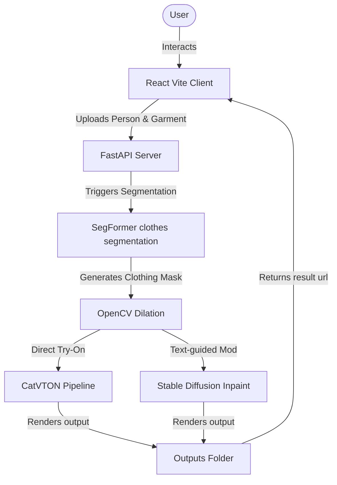

# Virtual Try-On: AI-Powered Local Virtual Try-On Studio

The virtual try on is a production-quality, 100% local, AI-powered Virtual Try-On web application. It combines a responsive React frontend (Vite + Tailwind CSS) with a FastAPI backend (Python + PyTorch + Diffusers) to perform virtual garment dressing and text-guided clothing modifications locally without relying on external cloud APIs or requiring API keys.

---

## Project Architecture

The application is structured into a frontend client and an AI inference server:



### Key Technical Pillars:
1. **Direct Virtual Try-On (Empty Prompt):** Uses **CatVTON** ("Concatenation Is All You Need") as the default Try-On model, running spatial concatenation of latents in PyTorch.
2. **Text-guided Wardrobe Edits (Non-empty Prompt):** Automatically switches to **Stable Diffusion 1.5 Inpainting** to execute edits matching natural language instructions (e.g. *"change shirt to black"*, *"make hoodie denim"*).
3. **Automatic Agnostic Masking:** Uses a localized **SegFormer** semantic segmentation model (`mattmdjaga/segformer_b2_clothes`) to automatically extract the silhouette of the person's upper/lower clothing, applying morphological dilation for seamless boundary blending.
4. **RTX 3050 VRAM Optimizations:**
   - **Active Device Offloading:** Switches model weights between VRAM and RAM depending on which pipeline is currently executing, staying comfortably under the 4GB VRAM threshold.
   - **Precision Tuning:** Uses `FP16` precision for CUDA operations to save 50% memory.
   - **Tiled & Sliced Latent VAE Processing:** Decodes latents block-by-block to prevent peak VRAM allocation spikes.

---

## Folder Structure

```
virtual-try-on/
├── backend/
│   ├── ai/
│   │   ├── base_model.py       # Abstract Base Class for Try-On backends
│   │   ├── catvton.py          # Wrapper for CatVTON Pipeline execution
│   │   ├── sd_inpaint.py       # Wrapper for SD Inpainting execution
│   │   ├── model_manager.py    # Memory offloader & model caches
│   │   ├── pipeline.py         # Custom CatVTON diffusers pipeline
│   │   ├── attn_processor.py   # CatVTON skip-cross-attention module
│   │   └── utils_catvton.py    # CatVTON image preprocessing helpers
│   ├── routes/
│   │   └── tryon.py            # API routes for upload, generation, and cleanup
│   ├── services/
│   │   └── segmentation.py     # SegFormer clothing segmentation service
│   ├── utils/
│   │   └── helpers.py          # Image compression & aspect-ratio scaling helpers
│   ├── models/                 # Model checkpoints directory (gitignored)
│   ├── uploads/                # User uploaded images directory (gitignored)
│   ├── outputs/                # Generated try-on results directory (gitignored)
│   ├── app.py                  # Main FastAPI application server
│   ├── download_models.py      # Local model downloader utility
│   └── requirements.txt        # Backend dependencies
├── frontend/
│   ├── src/
│   │   ├── components/
│   │   │   ├── BeforeAfterSlider.jsx  # Interactive split slide viewer
│   │   │   ├── ImageUpload.jsx        # Drag-and-drop file upload zone
│   │   │   └── WebcamCapture.jsx      # Webcam feed snapshot utility
│   │   ├── hooks/
│   │   │   └── useTheme.js            # Light/Dark mode hook
│   │   ├── pages/
│   │   │   └── Home.jsx               # Studio workbench dashboard layout
│   │   ├── services/
│   │   │   └── api.js                 # Axios API bindings
│   │   ├── App.jsx
│   │   └── index.css
│   ├── package.json
│   ├── tailwind.config.js
│   ├── postcss.config.js
│   └── index.html
├── .env.example
└── README.md
```

---

## Local Setup & Installation Guide

### Prerequisites
- Python 3.11+
- Node.js 18+
- NVIDIA GPU with CUDA drivers (Highly Recommended: RTX 3050 Laptop or above. Fallback to CPU is automatic if CUDA is unavailable).

### Backend Setup
1. Open a terminal and navigate to the backend folder:
   ```bash
   cd backend
   ```
2. Create and activate a Python virtual environment:
   ```bash
   python -m venv venv
   # Windows:
   venv\Scripts\activate
   # macOS/Linux:
   source venv/bin/activate
   ```
3. Install PyTorch with CUDA support first, then install the remaining requirements:
   ```bash
   # For Windows CUDA 12.1 (recommended for RTX 3050):
   pip install torch torchvision --index-url https://download.pytorch.org/whl/cu121
   
   # Install backend dependencies:
   pip install -r requirements.txt
   ```
4. Download the required open-source checkpoints:
   ```bash
   python download_models.py
   ```
   *(Note: This downloads ~5GB of model files from Hugging Face into backend/models/. This is a one-time operation. Make sure you have a stable network and enough disk space).*

### Frontend Setup
1. Open a new terminal and navigate to the frontend folder:
   ```bash
   cd frontend
   ```
2. Install Node packages:
   ```bash
   npm install
   ```
3. Run the development client:
   ```bash
   npm run dev
   ```
   The client will boot on `http://localhost:5173`.

---

## Running the Application

### 1. Launch Backend Server:
From the `backend` folder, with active virtual environment:
```bash
uvicorn app:app --reload --host 127.0.0.1 --port 8000
```
FastAPI will run on `http://localhost:8000`. Swagger docs are available on `http://localhost:8000/docs`.

### 2. Open Frontend:
Navigate your browser to `http://localhost:5173` to interact with the virtual try on.

---

## API Documentation

### 1. Upload Person Image
- **Endpoint:** `POST /upload/person`
- **Payload:** File (multipart/form-data)
- **Response:**
  ```json
  {
    "id": "uuid-string",
    "url": "/uploads/person_uuid-string.jpg",
    "filename": "person_uuid-string.jpg"
  }
  ```

### 2. Upload Clothing Image
- **Endpoint:** `POST /upload/cloth`
- **Payload:** File (multipart/form-data)
- **Response:**
  ```json
  {
    "id": "uuid-string",
    "url": "/uploads/cloth_uuid-string.jpg",
    "filename": "cloth_uuid-string.jpg"
  }
  ```

### 3. Generate Try-On Result
- **Endpoint:** `POST /generate`
- **Payload:** Form Fields (multipart/form-data)
  - `person_id`: string (UUID)
  - `cloth_id`: string (UUID)
  - `category`: string (optional: `"upper"`, `"lower"`, `"dress"`)
  - `prompt`: string (optional: Natural language edit instruction)
  - `height`: integer (optional: `512`)
  - `width`: integer (optional: `512`)
- **Response:**
  ```json
  {
    "result_id": "uuid-string",
    "url": "/outputs/result_uuid-string.jpg",
    "filename": "result_uuid-string.jpg"
  }
  ```

### 4. Fetch Generation Result
- **Endpoint:** `GET /result/{id}`
- **Response:** JPEG Image File Binary

### 5. Cleanup Temporary Files
- **Endpoint:** `DELETE /cleanup/{id}`
- **Response:**
  ```json
  {
    "status": "success",
    "message": "Cleanup task scheduled."
  }
  ```
  *(Note: This deletes the person upload, cloth upload, and result output for the session to prevent server storage leakage).*

---

## Troubleshooting Guide

### 1. CUDA Out of Memory (OOM)
- **Cause:** Multiple models loaded on the GPU at the same time, or inference resolution is set too high.
- **Solution:** 
  - Ensure `height` and `width` parameters are kept at `512` (the default).
  - The application automatically offloads unused models to CPU. If you still encounter OOM, restart the backend server to clear PyTorch's VRAM buffers.
  - Close other memory-intensive processes (like browsers or game engines) sharing GPU resources.

### 2. ModuleNotFoundError
- **Cause:** running inside the wrong Python virtual environment, or requirements installation was interrupted.
- **Solution:** Verify `venv` is active (should see `(venv)` in terminal prompt) and run `pip install -r requirements.txt` again.

### 3. Automatic Download Fails or Hangs
- **Cause:** Unstable connection to Hugging Face server.
- **Solution:** Set the environment variable `HF_HUB_DISABLE_SYMLINKS_WARNING=1` and run `python download_models.py` in a separate terminal. It supports resuming interrupted downloads.
